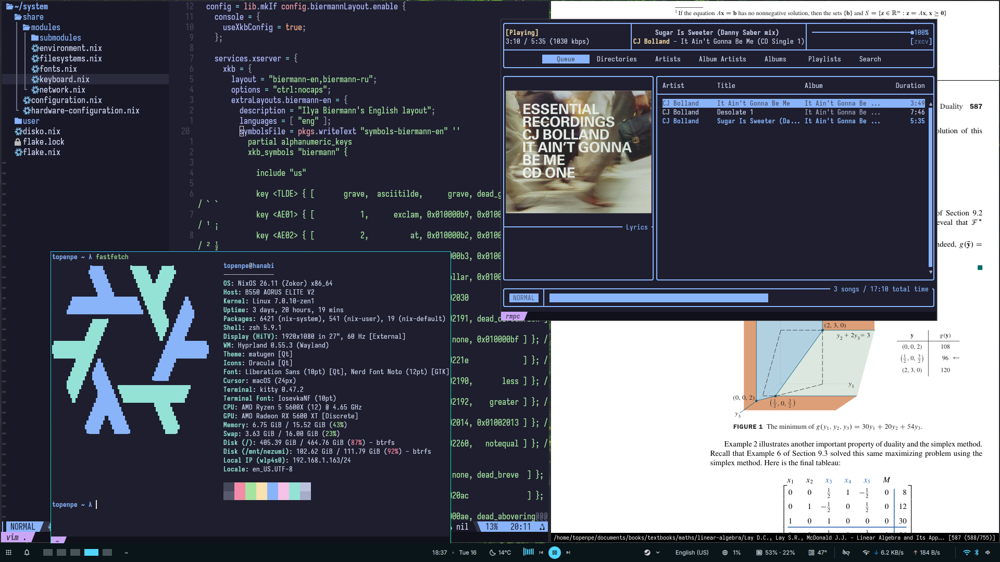

#+TITLE: My NixOS flake

#+ATTR_HTML: :align center

Just my desktop NixOS config.

** Features

- Declarative disk management with disko;
- Modular configuration, with togglable modules;
- Declarative Neovim config via nvf;
- Uses Niri + DMS desktop;
- Most programmes configured via their respectable modules.

When I have time I plan to configure shell and compositor in Nix too and then enable impermanence.

** Installation

- Clone the repo. Enable Nix experimental features if disabled.
- Review the disko.nix file.
- Change username and hostname in ./share/configuration.nix, ./user/home.nix, ./share/modules/network.nix and ./flake.nix files. Don’t forget to change home dir too.
- Set the password if needed. By default it’s set to empty and can only be changed in the ./share/configuration.nix file.
- If installing fresh, generate hardware-configuration.nix and delete the one in this repo. If trying out on an existing system, move the one you’re currently using to the repository’s directory.
- Turn off modules you don’t want. Custom modules are mostly handled in ./share/configuration.nix, ./share/modules/environment.nix and ./user/home.nix files. Carefully review everything else since this is my personal configuration and every setting is obviously highly opinionated.
- Switch/Install.
- You can use the =$ nh= command to rebuild the configuration later.
